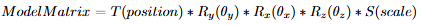
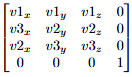
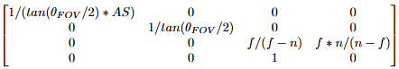

# Lab 3
follow instruction: https://hackmd.io/@lab31718/CGlab3

## functions completed
- [X] 3 transformation matrices
- [X] depth buffer
- [X] camera control
- [X] backculling

## how to implement?
### 3 transformation matrices
**Model Transformation (Model Matrix)** `GameObject::Matrix4 localToWorld()`
inverse of `worldToLocal()`, the Model Matrix is defined as 

**Camera Transformation (View Matrix)** `Camera::void setPositionOrientation(Vector3 pos, Vector3 lookat)`
`pos` is the position of eyes, `lookat` is the point the eye is looking at. $ \vec{view} = (lookat_x - pos_x, lookat_y - pos_y, lookat_z - pos_z) , \vec{top} = (0, 1, 0) $

$ \vec{v_1}=(\vec{top} \times \vec{view}), \vec{v_2}=(\vec{v_3} \times \vec{v_1}), \vec{v_3}=\vec{view} $ and general rotation matrix is defined as 

the View Matrix is defined as $ mirror_x * GRM * Translation(-pos) $

**Perspective Rendering (Projection Matrix)** `Camera::setSize(int w, int h, float n, float f)`
reference:
* https://www.youtube.com/watch?v=U0_ONQQ5ZNM

the Projection Matrix is defined as 

---
### depth buffer `util::getDepth(float x, float y, Vector3[] vertex)`
first, calculate the plane equation of given vertices (only 3 vertices are needed). then plug in the given `(x,y)`, and we will get the corrosponding `z`.

select 3 points (vertices) form `vertex`: `a, b, c`. $ \vec{n} = (\vec{ab} \times \vec{ac}) $ and $ E = n_x * (x -a_x) + n_y * (y - a_y) + n_z * (z - a_z) = 0 $

---
### camera control `HW3::keyPressed()`
reference:
* https://processing.org/reference/keyPressed_.html

use `Q, E, W, S, A, D` to control the camera horizontally or vertically, coordinates of camera position and the point it is looking at need to be updated at the same time

| Key Pressed | Effect |
| ----------- | ------------- |
| Q | camera moves up  |
| E | camera moves down |
| A | camera moves left |
| D | camera moves right |
| W | camera moves forward |
| S | camera moves backward |

---
### backculling `GameObject::debugDraw()`
reference:
* https://learnopengl.com/Advanced-OpenGL/Face-culling

find normal vectors of triangles of the mesh, then calculate $ \vec{norm} \cdot \vec{view} $ . if it is greater than `0`, which means the angle between normal vector and view vector (from face to camera) is smaller than `90°`, then the triangle is a front face. draw lines. otherwise, it is a back face. do not draw lines.

## YouTube DEMO Video

## used LLM as assistance
after implementing tasks by myself, if it did not work and I could not find solutions on the Internet either, I would explain the problem and ask `Gemini` for help